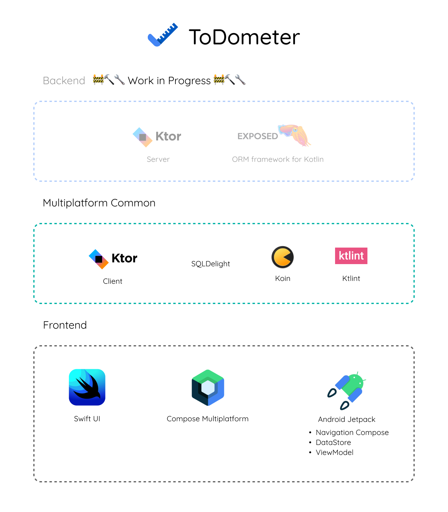
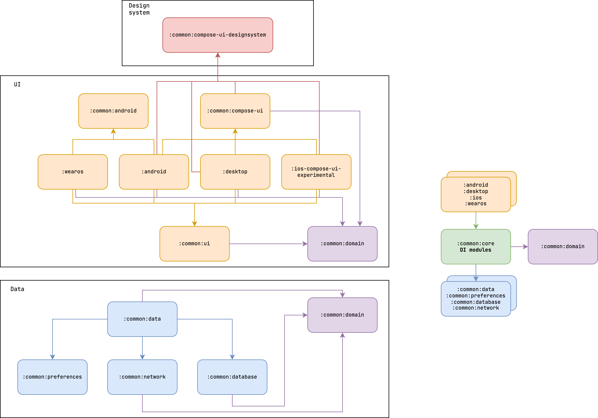

<h1 align="center">Todometer Kotlin Multiplatform</h1></br>

<p align="center">
  <a href="https://github.com/serbelga/ToDometer_Multiplatform/actions/workflows/build.yml" target="_blank">
    
  </a>
  <a href="https://github.com/serbelga/ToDometer_Multiplatform/actions/workflows/ktlint.yml" target="_blank">
    
  </a>
</p>

<h5 align="center">
✅ A meter to-do list built with Android Jetpack based on https://cassidoo.github.io/todometer/
</h5>

## Screenshots

### Android

|  |  |
|---|---|

### Wear OS

|  |  |  |  |  |
|---|---|---|---|---|

### Desktop


### iOS

Under construction

## Technologies

<div align="center">

</div>

### Android

* [Android Jetpack](https://developer.android.com/jetpack)
  * [Compose UI](https://developer.android.com/jetpack/compose)
  * [Compose Navigation](https://developer.android.com/jetpack/compose/navigation)
  * [Android KTX](https://developer.android.com/kotlin/ktx)
  * [ViewModel](https://developer.android.com/topic/libraries/architecture/viewmodel)
* [Koin](https://insert-koin.io/docs/reference/koin-android/start)

### Backend
* [Ktor Server](https://ktor.io/)
* [Jetbrains Exposed](https://github.com/JetBrains/Exposed)

### Common
* [Kotlin & Coroutines](https://kotlinlang.org/docs/coroutines-overview.html)
  * [Flow](https://kotlinlang.org/docs/flow.html)
* [Koin Multiplatform](https://insert-koin.io/docs/setup/v3/)
* [SQLDelight](https://cashapp.github.io/sqldelight/)
* [ktlint](https://ktlint.github.io/)
* [Ktor Client](https://ktor.io/docs/client.html)

### Desktop
* [Compose for Desktop](https://github.com/JetBrains/compose-jb)

### iOS
* [Swift UI](https://developer.apple.com/xcode/swiftui/)


## Modules

<div align="center">

</div>

### Backend

▶️ Run:

```
./gradlew :backend:run
```

### Desktop

▶️ Run:

```
./gradlew :desktop:run
```
