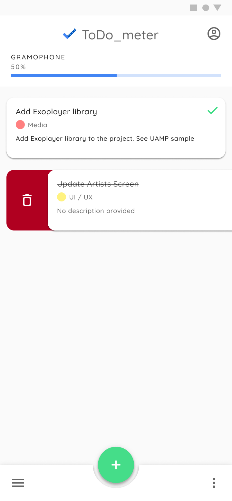
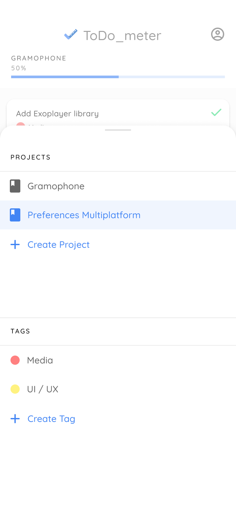
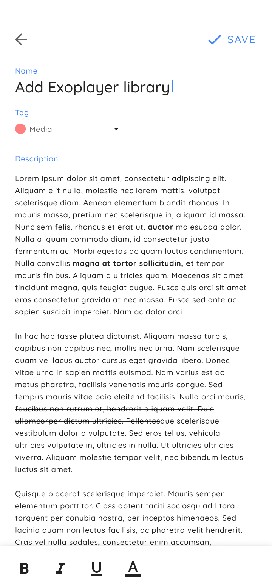

<h1 align="center">ToDo_meter Kotlin Multiplatform</h1> 

<h4 align="center">
  🚧🚧🚧 WIP: https://github.com/serbelga/ToDometer to Jetpack Compose
</h4>

<h5 align="center">
✅ A meter to-do list built with Android Jetpack based on https://cassidoo.github.io/todometer/
</h5>

## App UI Design

| </img> | </img> | </img> | </img> |
|---|---|---|---|

## Tech Stack
* Kotlin & Coroutines
  * Flow
* [Android Jetpack](https://developer.android.com/jetpack)
  * [Compose](https://developer.android.com/jetpack/compose)
  * [Android KTX](https://developer.android.com/kotlin/ktx)
  * [ViewModel](https://developer.android.com/topic/libraries/architecture/viewmodel)
* [Koin Multiplatform](https://insert-koin.io/docs/setup/v3/)
* [SQLDelight](https://cashapp.github.io/sqldelight/)
* [ktlint](https://ktlint.github.io/)
