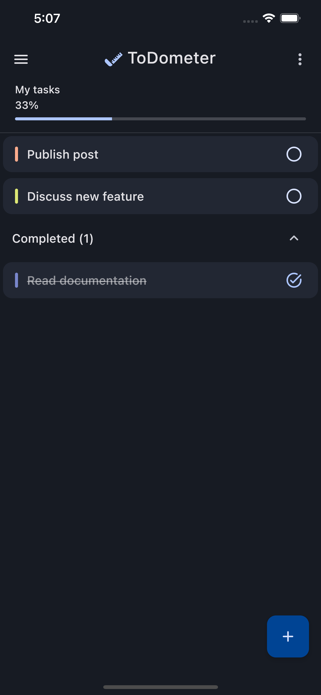
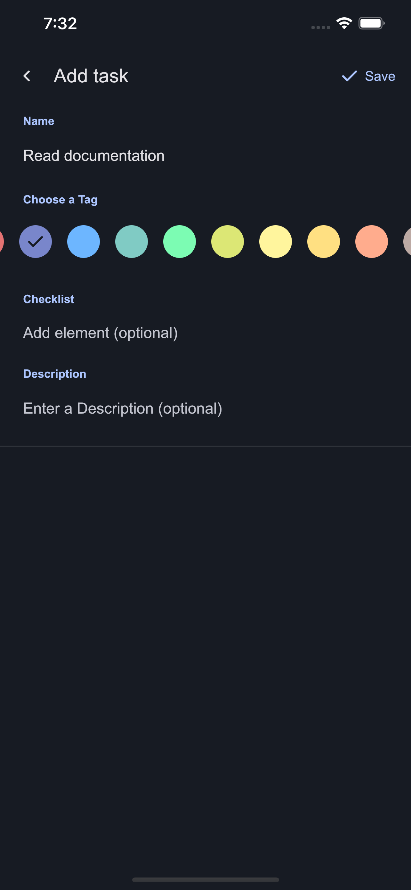

<h1 align="center">Todometer Kotlin Multiplatform</h1></br>

<p align="center">
  <a href="https://github.com/serbelga/ToDometer_Multiplatform/actions/workflows/build.yml" target="_blank">
    
  </a>
</p>

<h5 align="center">
✅ A meter to-do list built with Kotlin Multiplatform and Compose UI Multiplatform based on https://cassidoo.github.io/todometer/
</h5>

<a target="_blank" href="https://play.google.com/store/apps/details?id=dev.sergiobelda.todometer">
<p align="center">

</p>
</a>

<br/>

## Screenshots

### Android

|  |  |  |
|----------------------------------------------------------|--------------------------------------------------------------|-----------------------------------------------------------------|

### Material Design 3 Dynamic color

|  |  |  |  |
|-------------------------------------------------------------------------------|-----------------------------------------------------------------------------|------------------------------------------------------------------------------|---------------------------------------------------------------------------------|

### Glance App Widget - Material Design 3 Dynamic color

|  |
|--------------------------------------------------------------------------|

### Desktop

`./gradlew :app-desktop:run`

|  |  |
|----------------------------------------------------------|--------------------------------------------------------------|

### iOS

Open `app-ios/Todometer.xcodeproj` in XCode or run it in Android Studio using Kotlin Multiplatform Mobile plugin.

|  |  |
|-----------------------------------------------------------|---------------------------------------------------------------|

### Wear OS

|  |  |  |  |  |
|---------------------------------------------------------|----------------------------------------------------------|---------------------------------------------------------|---------------------------------------------------------------------|----------------------------------------------------------------|

<br/>

## Technologies

#### Android

* [Android Jetpack](https://developer.android.com/jetpack)
    * [Android KTX](https://developer.android.com/kotlin/ktx)
    * [Glance App Widget](https://developer.android.com/jetpack/androidx/releases/glance)

#### Wear OS

* [Wear Compose](https://developer.android.com/jetpack/androidx/releases/wear-compose)
* [Wear Compose Navigation](https://developer.android.com/reference/kotlin/androidx/wear/compose/navigation/package-summary)

#### Common

* [Compose UI Multiplatform](https://www.jetbrains.com/lp/compose-multiplatform/)
* [Compose ViewModel Multiplatform](https://www.jetbrains.com/help/kotlin-multiplatform-dev/compose-lifecycle.html)
* [Compose Navigation Multiplatform](https://www.jetbrains.com/help/kotlin-multiplatform-dev/compose-navigation-routing.html)
* [compose-vectorize](https://github.com/serbelga/compose-vectorize)
* [navigation-compose-extended](https://github.com/serbelga/navigation-compose-extended)
* [Kotlin & Coroutines](https://kotlinlang.org/docs/coroutines-overview.html)
    * [Flow](https://kotlinlang.org/docs/flow.html)
* [Koin Multiplatform](https://insert-koin.io/docs/reference/koin-mp/kmp)
* [Lyricist](https://github.com/adrielcafe/lyricist)
* [spotless](https://github.com/diffplug/spotless)
* [SQLDelight](https://cashapp.github.io/sqldelight/)

## Images

- Illustrations: https://undraw.co/illustrations
- Icons: https://fonts.google.com/icons
- Logotype, Isotype: Made with Figma

<br/>

## License

```
   Copyright 2023 Sergio Belda

   Licensed under the Apache License, Version 2.0 (the "License");
   you may not use this file except in compliance with the License.
   You may obtain a copy of the License at

       http://www.apache.org/licenses/LICENSE-2.0

   Unless required by applicable law or agreed to in writing, software
   distributed under the License is distributed on an "AS IS" BASIS,
   WITHOUT WARRANTIES OR CONDITIONS OF ANY KIND, either express or implied.
   See the License for the specific language governing permissions and
   limitations under the License.
```
