<h1 align="center">Todometer Kotlin Multiplatform</h1></br>

<p align="center">
  <a href="https://github.com/serbelga/ToDometer_Multiplatform/actions/workflows/build.yml" target="_blank">
    
  </a>
</p>

<h5 align="center">
✅ A meter to-do list built with Android Jetpack based on https://cassidoo.github.io/todometer/
</h5>

<a target="_blank" href="https://play.google.com/store/apps/details?id=dev.sergiobelda.todometer">
<p align="center">

</p>
</a>

## Setup

Android and Wear OS apps are using [Firebase Crashlytics](https://firebase.google.com/products/crashlytics). You need to create a project in Firebase Console and copy `google-services.json` file into android and wearos folders to be able to launch them. I've created an issue for this in order to avoid requiring this file https://github.com/serbelga/ToDometerMultiplatform/issues/114.

<br/>

## Screenshots

### Android

| 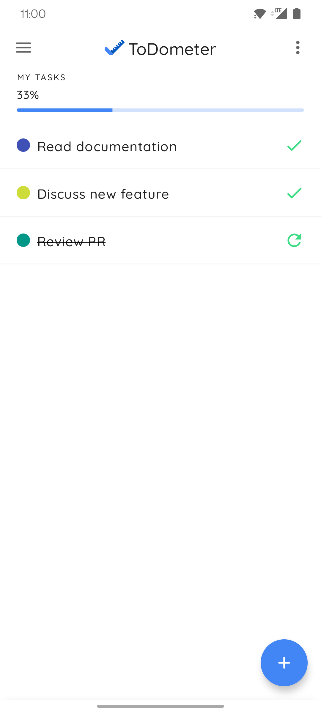 | 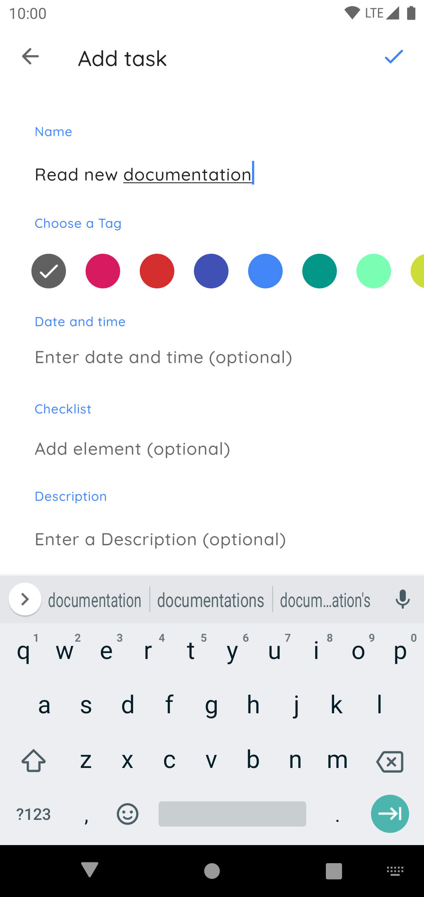 | 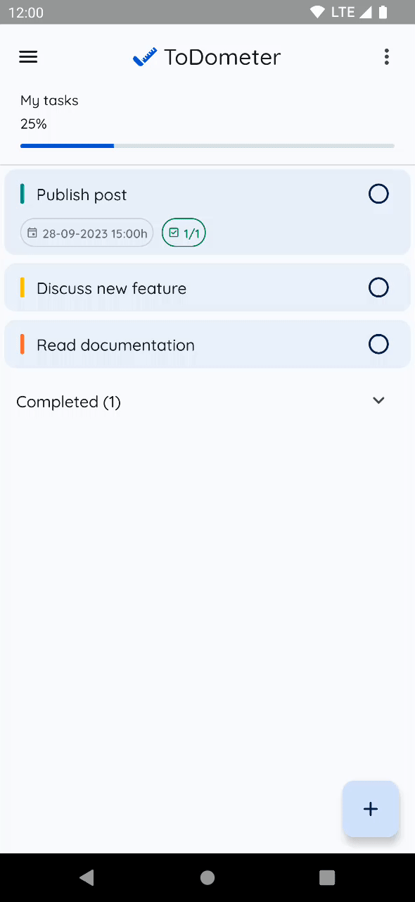 |
|---|---|---|

### Material Design 3 Dynamic color

| 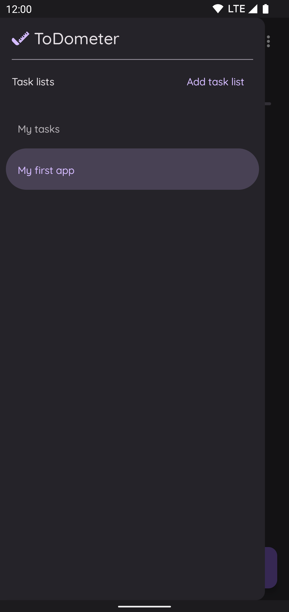 | 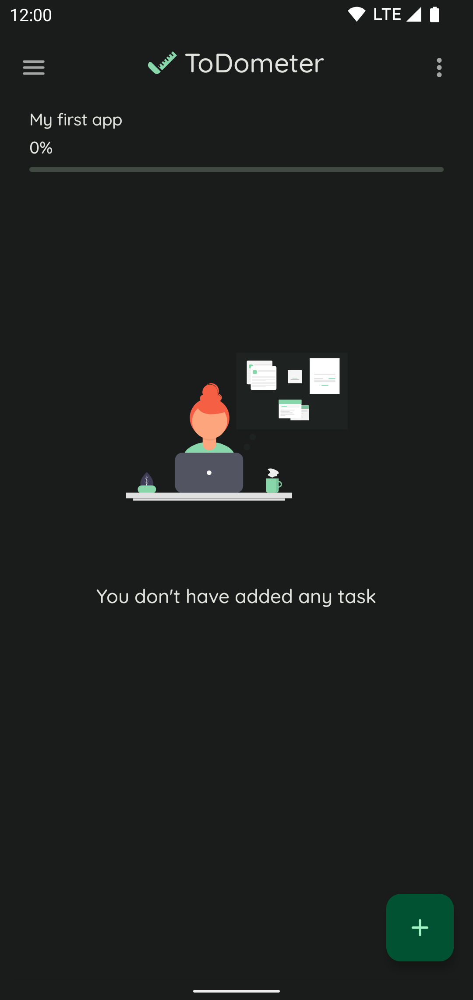 | 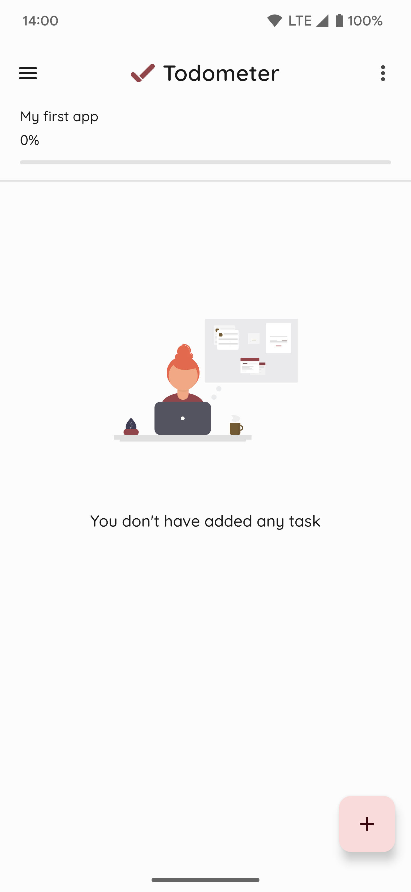 | 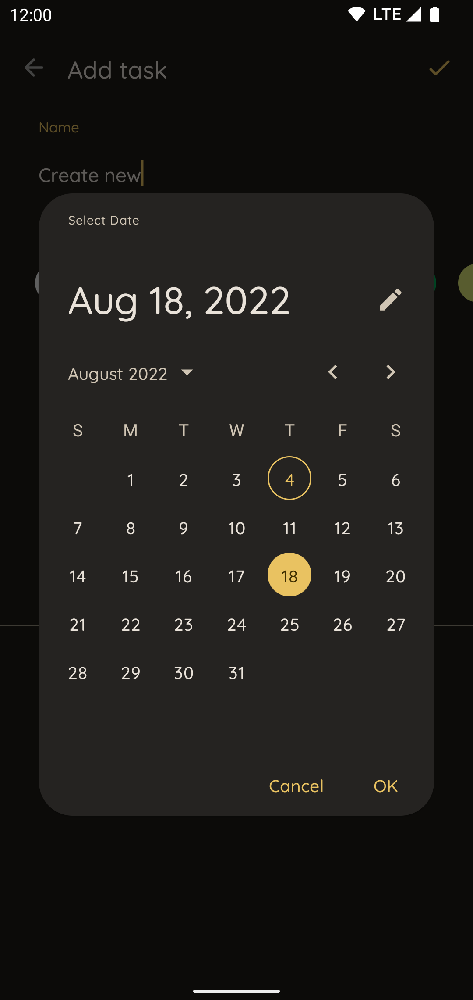 |
|---|---|---|---|

### Glance App Widget - Material Design 3 Dynamic color

| 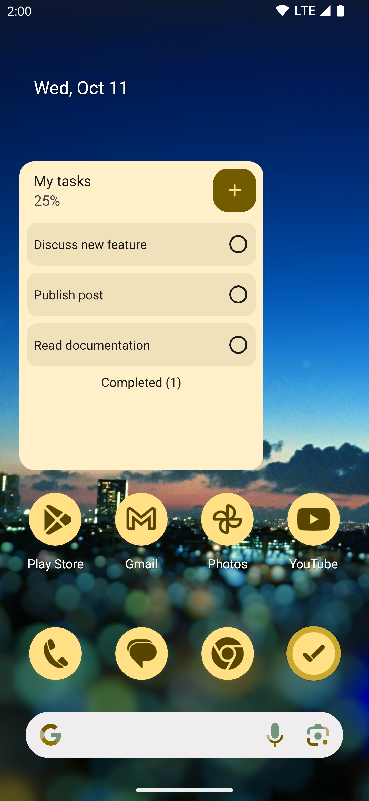 |
|---|

### Wear OS

| 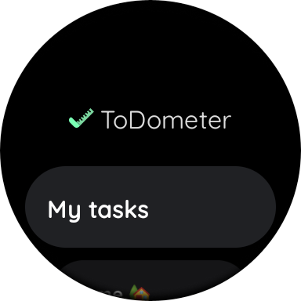 | 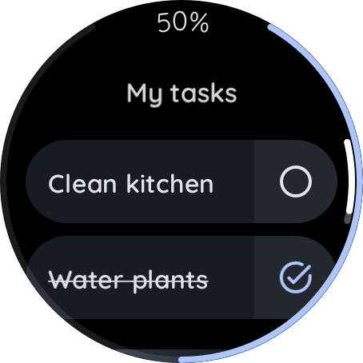 | 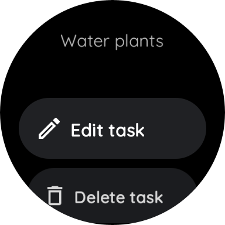 | 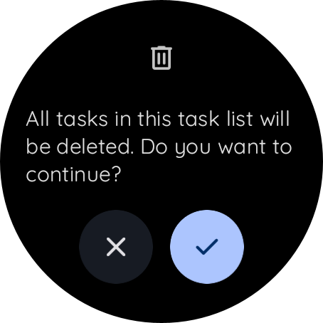 | 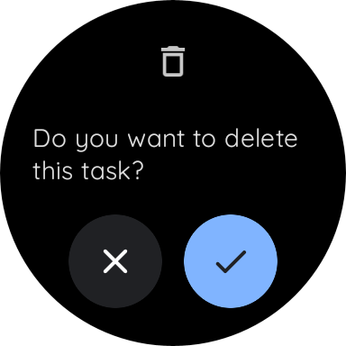 |
|---|---|---|---|---|

### Desktop

`./gradlew :desktop:run`

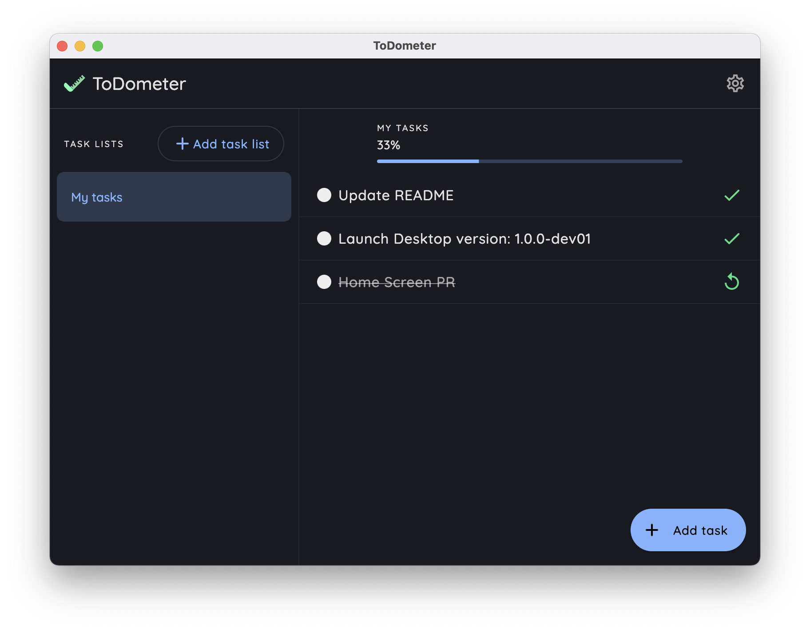

### iOS

Under construction

<br/>

## Technologies

### Android

* [Android Jetpack](https://developer.android.com/jetpack)
  * [Compose Navigation](https://developer.android.com/jetpack/compose/navigation)
  * [Android KTX](https://developer.android.com/kotlin/ktx)
  * [ViewModel](https://developer.android.com/topic/libraries/architecture/viewmodel)
  * [Glance App Widget](https://developer.android.com/jetpack/androidx/releases/glance)
* [Koin](https://insert-koin.io/docs/reference/koin-android/start)

### Wear OS

* [Wear Compose](https://developer.android.com/jetpack/androidx/releases/wear-compose)
* [Wear Compose Navigation](https://developer.android.com/reference/kotlin/androidx/wear/compose/navigation/package-summary)

### 🚧 Backend

* [Ktor Server](https://ktor.io/)
* [Jetbrains Exposed](https://github.com/JetBrains/Exposed)

### Common

* [Compose Multiplatform](https://www.jetbrains.com/lp/compose-mpp/)
* [Kotlin & Coroutines](https://kotlinlang.org/docs/coroutines-overview.html)
  * [Flow](https://kotlinlang.org/docs/flow.html)
* [Koin Multiplatform](https://insert-koin.io/docs/setup/v3/)
* [SQLDelight](https://cashapp.github.io/sqldelight/)
* [ktlint](https://ktlint.github.io/)
* [Ktor Client](https://ktor.io/docs/client.html)
* [moko-resources](https://github.com/icerockdev/moko-resources)

<br/>

### Desktop

▶️ Run:

```
./gradlew :desktop:run
```

### Backend

▶️ Run:

```
cd backend && ./gradlew run
```
