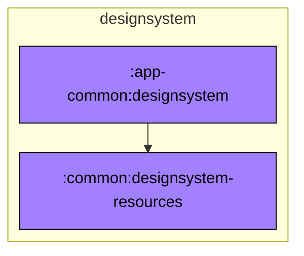

## :app:common:designsystem

```mermaid
---
config:
  layout: elk
  elk:
    nodePlacementStrategy: SIMPLE
---
graph TB
  subgraph designsystem
    direction TB
    :app-common:designsystem[:app-common:designsystem]:::kmp-library
    :common:designsystem-resources[:common:designsystem-resources]:::kmp-library
  end

  :app-common:designsystem --> :common:designsystem-resources

classDef android-application fill:#CAFFBF,stroke:#000,stroke-width:1px,color:#000;
classDef android-feature fill:#FFD6A5,stroke:#000,stroke-width:1px,color:#000;
classDef android-library fill:#9BF6FF,stroke:#000,stroke-width:1px,color:#000;
classDef android-test fill:#A0C4FF,stroke:#000,stroke-width:1px,color:#000;
classDef jvm-library fill:#BDB2FF,stroke:#000,stroke-width:1px,color:#000;
classDef kmp-library fill:#A280FF,stroke:#000,stroke-width:1px,color:#000;
classDef unknown fill:#FFADAD,stroke:#000,stroke-width:1px,color:#000;
```