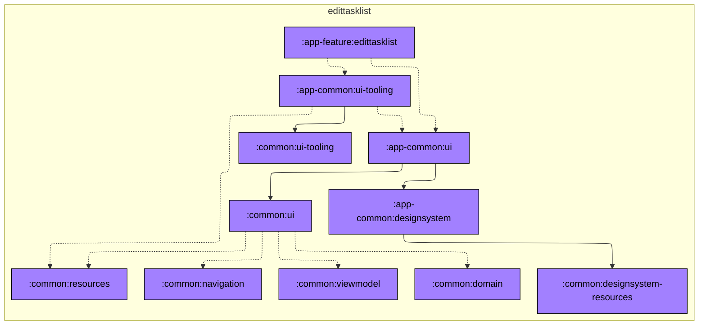

## :app-feature:edittasklist

```mermaid
---
config:
  layout: elk
  elk:
    nodePlacementStrategy: SIMPLE
---
graph TB
  subgraph edittasklist
    direction TB
    :app-feature:edittasklist[:app-feature:edittasklist]:::kmp-library
    :app-common:ui[:app-common:ui]:::kmp-library
    :app-common:ui-tooling[:app-common:ui-tooling]:::kmp-library
    :app-common:designsystem[:app-common:designsystem]:::kmp-library
    :common:designsystem-resources[:common:designsystem-resources]:::kmp-library
    :common:domain[:common:domain]:::kmp-library
    :common:navigation[:common:navigation]:::kmp-library
    :common:resources[:common:resources]:::kmp-library
    :common:viewmodel[:common:viewmodel]:::kmp-library
    :common:ui[:common:ui]:::kmp-library
    :common:ui-tooling[:common:ui-tooling]:::kmp-library
  end

  :app-feature:edittasklist -.-> :app-common:ui
  :app-feature:edittasklist -.-> :app-common:ui-tooling

  :app-common:ui --> :app-common:designsystem
  :app-common:ui --> :common:ui

  :app-common:ui-tooling --> :common:ui-tooling
  :app-common:ui-tooling -.-> :app-common:ui
  :app-common:ui-tooling -.-> :common:resources

  :app-common:designsystem --> :common:designsystem-resources

  :common:ui -.-> :common:domain
  :common:ui -.-> :common:navigation
  :common:ui -.-> :common:resources
  :common:ui -.-> :common:viewmodel

classDef android-application fill:#CAFFBF,stroke:#000,stroke-width:1px,color:#000;
classDef android-feature fill:#FFD6A5,stroke:#000,stroke-width:1px,color:#000;
classDef android-library fill:#9BF6FF,stroke:#000,stroke-width:1px,color:#000;
classDef android-test fill:#A0C4FF,stroke:#000,stroke-width:1px,color:#000;
classDef jvm-library fill:#BDB2FF,stroke:#000,stroke-width:1px,color:#000;
classDef kmp-library fill:#A280FF,stroke:#000,stroke-width:1px,color:#000;
classDef unknown fill:#FFADAD,stroke:#000,stroke-width:1px,color:#000;
```