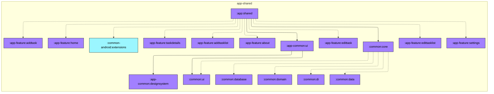

## :app:shared

```mermaid
---
config:
  layout: elk
  elk:
    nodePlacementStrategy: SIMPLE
---
graph TB
  subgraph app-shared
    direction TB
    :app:shared[:app:shared]:::kmp-library
    :app-common:ui[:app-common:ui]:::kmp-library
    :common:core[:common:core]:::kmp-library
    :common-android:extensions[:common-android:extensions]:::android-library
    :app-feature:about[:app-feature:about]:::kmp-library
    :app-feature:addtask[:app-feature:addtask]:::kmp-library
    :app-feature:addtasklist[:app-feature:addtasklist]:::kmp-library
    :app-feature:edittask[:app-feature:edittask]:::kmp-library
    :app-feature:edittasklist[:app-feature:edittasklist]:::kmp-library
    :app-feature:home[:app-feature:home]:::kmp-library
    :app-feature:settings[:app-feature:settings]:::kmp-library
    :app-feature:taskdetails[:app-feature:taskdetails]:::kmp-library
    :app-common:designsystem[:app-common:designsystem]:::kmp-library
    :common:ui[:common:ui]:::kmp-library
    :common:data[:common:data]:::kmp-library
    :common:database[:common:database]:::kmp-library
    :common:di[:common:di]:::kmp-library
    :common:domain[:common:domain]:::kmp-library
  end

  :app:shared --> :app-common:ui
  :app:shared --> :common:core
  :app:shared -.-> :app-feature:about
  :app:shared -.-> :app-feature:addtask
  :app:shared -.-> :app-feature:addtasklist
  :app:shared -.-> :app-feature:edittask
  :app:shared -.-> :app-feature:edittasklist
  :app:shared -.-> :app-feature:home
  :app:shared -.-> :app-feature:settings
  :app:shared -.-> :app-feature:taskdetails
  :app:shared -.-> :common-android:extensions

  :app-common:ui --> :app-common:designsystem
  :app-common:ui --> :common:ui

  :common:core -.-> :common:data
  :common:core -.-> :common:database
  :common:core -.-> :common:di
  :common:core -.-> :common:domain
  :common:core -.-> :common:ui

classDef android-application fill:#CAFFBF,stroke:#000,stroke-width:1px,color:#000;
classDef android-feature fill:#FFD6A5,stroke:#000,stroke-width:1px,color:#000;
classDef android-library fill:#9BF6FF,stroke:#000,stroke-width:1px,color:#000;
classDef android-test fill:#A0C4FF,stroke:#000,stroke-width:1px,color:#000;
classDef jvm-library fill:#BDB2FF,stroke:#000,stroke-width:1px,color:#000;
classDef kmp-library fill:#A280FF,stroke:#000,stroke-width:1px,color:#000;
classDef unknown fill:#FFADAD,stroke:#000,stroke-width:1px,color:#000;
```
