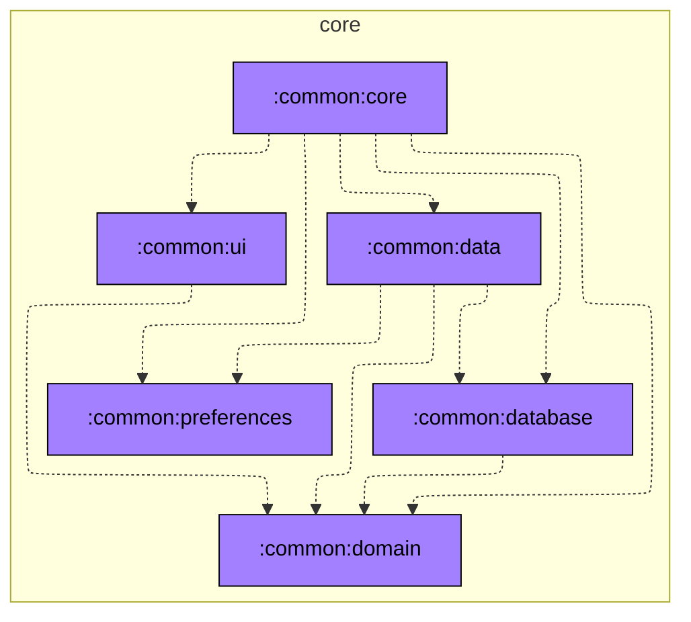

## :common-core

```mermaid
---
config:
  layout: elk
  elk:
    nodePlacementStrategy: SIMPLE
---
graph TB
  subgraph core
    direction TB
    :core[:common:core]:::kmp-library
    :data[:common:data]:::kmp-library
    :database[:common:database]:::kmp-library
    :domain[:common:domain]:::kmp-library
    :preferences[:common:preferences]:::kmp-library
    :ui[:common:ui]:::kmp-library
  end

  :core -.-> :data
  :core -.-> :database
  :core -.-> :domain
  :core -.-> :preferences
  :core -.-> :ui
  :data -.-> :database
  :data -.-> :domain
  :data -.-> :preferences
  :database -.-> :domain
  :ui -.-> :domain

classDef android-application fill:#CAFFBF,stroke:#000,stroke-width:1px,color:#000;
classDef android-feature fill:#FFD6A5,stroke:#000,stroke-width:1px,color:#000;
classDef android-library fill:#9BF6FF,stroke:#000,stroke-width:1px,color:#000;
classDef android-test fill:#A0C4FF,stroke:#000,stroke-width:1px,color:#000;
classDef jvm-library fill:#BDB2FF,stroke:#000,stroke-width:1px,color:#000;
classDef kmp-library fill:#A280FF,stroke:#000,stroke-width:1px,color:#000;
classDef unknown fill:#FFADAD,stroke:#000,stroke-width:1px,color:#000;
```
