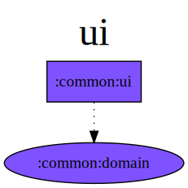

## :common-ui



### DI: Koin example

```kotlin
class SettingsViewModel(
    getAppThemeUseCase: GetAppThemeUseCase,
    private val setAppThemeUseCase: SetAppThemeUseCase,
) : BaseViewModel<SettingsUIState>(
    initialUIState = SettingsUIState(),
) {
```

```kotlin
val settingsViewModelModule = module {
    viewModelOf(::SettingsViewModel)
}
```

Important: Define the type of the ViewModel in the `koinViewModel` function to inject de viewmodel. 
`koinViewModel()` without `<SettingsViewModel>` doesn't work.

```kotlin
composable(navDestination = SettingsNavDestination) {
    SettingsScreen.NavigationNodeContent(
        navigationEventHandler = settingsNavigationEventHandler,
        viewModel = koinViewModel<SettingsViewModel>(),
    )
}
```

### DI: Koin DI extensions

```kotlin
val settingsViewModelModule = module {
    baseViewModelOf(::SettingsViewModel)
}
```

```kotlin
composable(navDestination = SettingsNavDestination) {
    SettingsScreen.NavigationNodeContent(
        navigationEventHandler = settingsNavigationEventHandler,
        viewModel = koinBaseViewModel(),
    )
}
```

#### DI: Koin DI Navigation extensions

Syntax sugar `KoinNavigationNodeContent`

```kotlin
composable(navDestination = SettingsNavDestination) {
    SettingsScreen.KoinNavigationNodeContent(
        navigationEventHandler = settingsNavigationEventHandler,
    )
}
```
